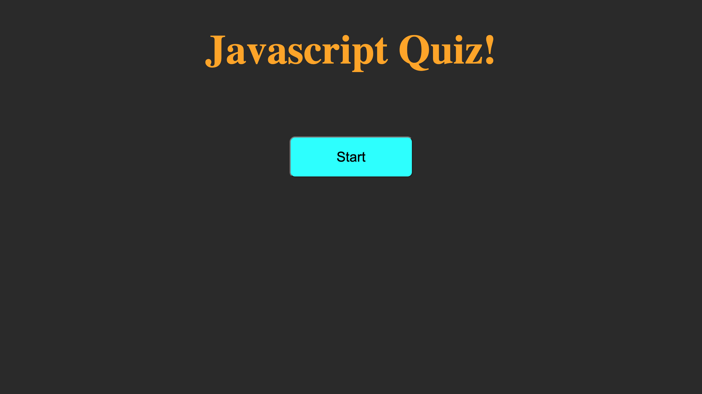
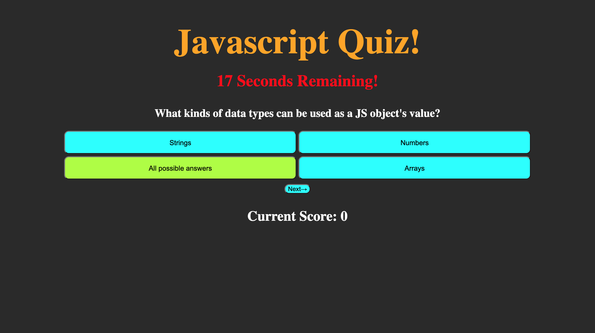
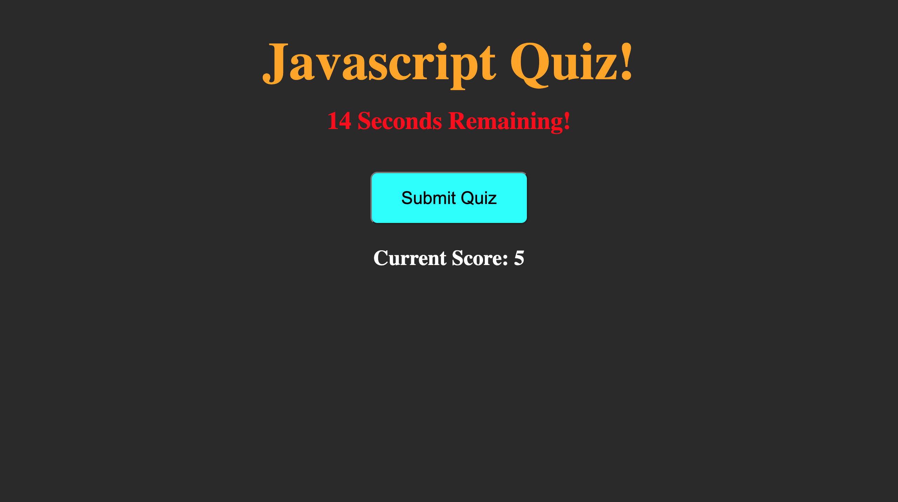
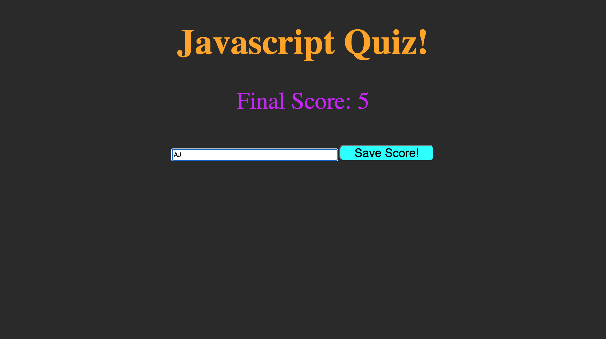
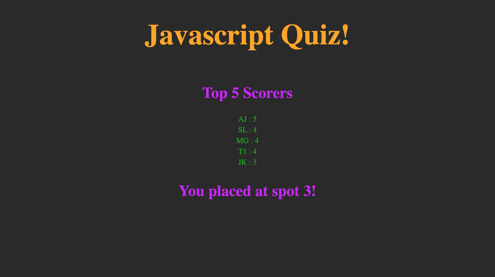

# Javascript Code Quiz

This web application is a simple coding quiz game about HTML, CSS, and Javascript sytax that was created using these very languages. 

## Link

https://austinjoo97.github.io/coding-quiz-gwuhw4/

## About the Application

The program itself cycles through multiple html divs that are conditionally hidden and shown through css property adjustments. When a user first loads the quiz, they will be presented with a simple screen with the quiz title (rendered using an HTML h1 tag) and a start button.
  
Upon clicking the start button, the initial html button will become hidden and the first question and answer set will be loaded. There will also be a timer that is visible to the user; starting at 30 seconds, it will continue to decrement until the quiz is over. 

With each question that is rendered to the viewport, a set of answer buttons and a next button, with the prior becoming visible to the user in a random order (to prevent cheating to replicate a real quiz), and each answer option has the ability to change color upon both hovering and focusing to indicate to the user which answer was selected. After selecting an answer, the "next" button can be clicked which will check the selected answer to that which is set in the answerKey object within the JS file. If the wrong answer answer is selected, 3 seconds will be taken from the remaining number of seconds, accelerating the progression of the quiz. If the answer is correct, a currentScore html element will be updated to indicate to the user what their current score is. 

After either the time runs out or the user clicks "submit" after answering the final question, questions and their corresponding answers will not longer render and, instead, the user's final score and an input box will be visible. The input will accept any 2 character string that will be used to save the user's userInitials to localstorage along with the score. 

After saving the score and initials, the user will be taken to a page which will notify the user where in the score-ladder he/she placed as well as rendering the top 5 highest scorers of the quiz. This top 5 list will be generated by interating and rendering the first 5 score objects saved to the localstorage.hiScore key's value which will hold an array of score:userInitials objects that were sorted in descending order based on score. 

## Screenshots

The first screenshot shows the first page the user is presented to upon loading the quiz. There is a title that will persist throughout the quiz as well as a start button.

The second screenshot shows one of the questions rendered as well as the answer choices. It also exemplifies the answer choices' ability to change color upon being focused as well as the decrementing timer.

This screenshot shows the submit button that will be displayed to the user upon completing the quiz that can be clicked to render a save score page.

The penultimate screenshot displays the page, asking the user enter a character string to be saved with the currentScore. After clicking save button, the currentScore and userInitials will be saved as an object in the localstorage.hiScore array created upon the first save by a user.

This final screenshot shows the final page that will be rendered to the screen after the user saves their score. The final page will show the user 2 things; the first being the top 5 scorers that have been saved to localstorage and the second being where in the array the user has placed. The latter will indicate the user how well they performed as compared to other people who took this quiz.
